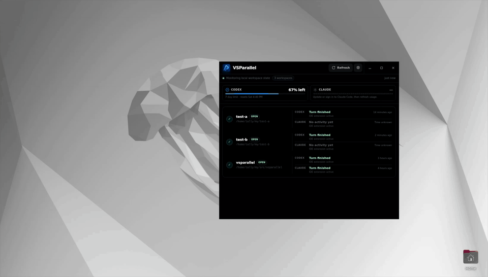

# VSParallel

VSParallel is a local-first desktop companion for developers working across
multiple VS Code windows. It brings every workspace into one clear overview,
showing workspace activity, focus, and coarse Codex and Claude Code lifecycle
status at a glance.

Switch between projects instantly, return to the workspace that needs your
attention, and access active workspaces directly from the native system tray—all
without interrupting your flow.



VSParallel has no account system, telemetry, analytics, or advertising. Its
workspace and provider monitoring remain local. VSParallel asks the user's
installed Codex `app-server` and signed-in Claude CLI for live rate-limit
percentages and reset times. Each provider subprocess owns its authentication
and any network connection. VSParallel does not read or store either
credential, and it does not persist the live usage responses.

VSParallel does not extract, log, retain, or transmit prompts, responses,
source code, terminal contents, transcripts, or Git data. Optional lifecycle
hooks receive documented provider event payloads, extract only the event name,
session ID, and working directory, and discard all unselected fields. Live
provider usage handling and Claude Code's local status-line fallback similarly
retain only rate-limit percentages and reset times. See
[PRIVACY.md](PRIVACY.md) for the complete local-data and cleanup policy.

## Requirements and platform support

- VS Code 1.85 or newer
- VS Code's `code` command-line interface
- The platform WebView and runtime libraries required by Tauri 2

| Platform | GitHub Release downloads |
| --- | --- |
| Ubuntu Linux | x86-64 Debian package and AppImage |
| macOS 12.3+ | Universal DMG for Apple silicon and Intel |
| Windows | x86-64 NSIS installer |

Build macOS and Windows packages on native runners. Production signing and
notarization are not configured yet.

The macOS glass panel uses Tauri's transparent-window private API. This is
compatible with the project's direct DMG distribution, but not with Mac App
Store submission.

See the [release and download guide](docs/releases.md) for the tag-based release
process, exact files to download, and current signing warnings.

On Ubuntu and other GNOME-based desktops, the shell must provide an
AppIndicator or StatusNotifier host for the tray icon to appear.

## Install and set up

Install the package for your platform, launch VSParallel, and then:

On macOS, copy `VSParallel.app` to `/Applications` before installing provider
hooks. If hooks were installed while the app ran from a mounted `/Volumes` DMG
or an App Translocation path, relaunch the installed app and choose **Repair**
for both provider integrations.

1. Select the settings gear beside **Refresh**.
2. Install the **VS Code companion**.
3. Optionally install **Codex lifecycle hooks**, **Claude Code lifecycle
   hooks**, or both.
4. Reload VS Code windows that were already open and restart affected provider
   sessions.
5. After installing Codex hooks, run `/hooks` in Codex, review the three
   VSParallel handlers, and trust them.

The final Codex review is an intentional security boundary. VSParallel reads
Codex's resulting user-level trust status but never attempts to approve user
hooks on your behalf. Workspace settings can still disable hooks. Opening Codex
or `/hooks` does not create an activity marker; after trusting the handlers,
submit a prompt from the monitored workspace.

The bundled companion extension reports workspace, focus, heartbeat, and
provider-extension presence through documented VS Code APIs. Optional lifecycle
hooks add coarse **Activity detected**, **Turn finished**, and
**Failed/interrupted** states. Before the first matching hook event, the UI says
**No activity yet**; lifecycle information older than 24 hours becomes
**Unknown**. Extension activation alone is never presented as active work.

The global usage cards refresh every 60 seconds and when **Refresh** is selected.
Codex usage is available when a signed-in local `codex` executable—on `PATH`
or bundled with a locally installed Codex VS Code extension—supports
`app-server`. It does not depend on the Codex lifecycle hooks.
Claude Code usage is available when a signed-in `claude` executable—on `PATH`
or bundled with the installed Claude VS Code extension—supports the CLI/SDK
control-channel usage getter. This is an evolving Claude CLI compatibility
interface, not a documented stable standalone command. VSParallel actively asks
it for the five-hour and seven-day windows, so usage works for graphical VS Code
Claude sessions that do not run `statusLine`. Lifecycle hooks and status-line
installation are not required for the active query. The managed `statusLine`
cache remains a local fallback for terminal Claude and older versions. If the
user already has a custom status line, VSParallel preserves it; only that
cache's managed refresh is unavailable, and any existing record may remain
visible as stale.

Claude's current full-usage getter also calculates local attribution summaries.
VSParallel prevents it from seeing real session history by running the query
with a new empty, private configuration directory and no session persistence,
while Claude keeps control of its existing secure authentication. The parser
keeps only rate-limit windows and discards account, session, attribution, and
other response fields.

Use a workspace card to ask VS Code to open or activate its exact target.
VSParallel then stays available as a compact always-on-top panel: choose another
workspace, restore the full window, or temporarily hide the panel. The panel
uses native vibrancy on macOS and acrylic blur on supported Windows versions;
Linux uses a compositor-friendly translucent surface when native background
blur is unavailable. A short non-focusing visibility check follows delayed VS
Code activation so the panel remains available when an existing editor window
is on another virtual desktop. On macOS it requests the native auxiliary
full-screen Space behavior; on Windows it follows the verified foreground
editor with the public virtual-desktop API.
The tray menu can also activate an active target. Closing the full window hides
it when the tray is available; choose **Quit VSParallel** from the tray menu to
stop the application.

Packaged releases check GitHub Releases for updates once in the background after
startup. When a newer signed version is available, an in-app banner can download
and install it, show progress, and restart VSParallel. Choose **Later** to defer
it for the current session, or use **Check for updates** in **Setup &
diagnostics**. Development builds, an unpublished release endpoint, and
temporary updater failures do not interrupt the local monitor.

### Installed components

The VS Code companion is embedded in the desktop application and installed
through VS Code's supported extension command. Temporary installation files are
removed after the installed version is verified. The extension ID is
`vsparallel.vsparallel-companion`.

The Codex and Claude Code integrations merge VSParallel-owned handlers into the
providers' user configuration. Existing unrelated settings and hooks are
preserved, writes are atomic, and a one-time backup is created before the first
change.

When no `statusLine` is configured, the Claude Code integration also installs a
privacy-minimal fallback usage capture command with a 60-second refresh
interval. An existing custom `statusLine` is unrelated user configuration and
is left unchanged. Lifecycle monitoring and the active Claude usage query can
still work; only VSParallel's managed refresh of the status-line fallback is
disabled.

To use VS Code Insiders or another installation, set
`VSPARALLEL_CODE_COMMAND` to its absolute executable path before launching
VSParallel.

Codex usage tries `codex` on `PATH` and the executable bundled with the locally
installed Codex VS Code extension. To select another signed-in executable, set
`VSPARALLEL_CODEX_COMMAND` to its absolute path before launching VSParallel.

Claude Code usage can use either `claude` on `PATH` or the executable bundled
with the installed Claude VS Code extension, trying the other source if the
first query fails. To select another signed-in executable, set
`VSPARALLEL_CLAUDE_COMMAND` to its absolute path before launching VSParallel.

## How it works

```text
VS Code companion ─ workspace/focus/extension heartbeat ─┐
Codex hooks ───────────── coarse lifecycle marker ────────┼─ local state ─┐
Claude Code hooks ─────── coarse lifecycle marker ────────┤               │
Claude Code statusLine ── fallback usage cache ───────────┘               │
Claude CLI control ────── live usage percentages/reset times ─────────────┤─ Rust core ─ Tauri UI
Codex app-server ──────── hook trust + live usage percentages/reset times ┘             └─ native tray
```

The desktop application uses Tauri 2, a Rust backend, and a framework-free
HTML/CSS/TypeScript UI compiled to static JavaScript. The dependency-free
companion extension writes local workspace heartbeats. Optional provider hooks
write only coarse lifecycle records. Claude and Codex limits are fetched live
through their provider-owned processes and are not written to the state
directory. The Claude Code status-line fallback writes a separate global
`usage/claude.json` record containing only captured percentages, reset times,
and a capture timestamp. The Rust backend validates these records and serves
UI-safe snapshots to the main window; the workspace snapshot also feeds the
native tray menu.

Lifecycle state is hook-derived rather than an internal provider progress feed.
Records are associated with workspaces by local path, and exact native-window
foregrounding remains subject to VS Code and operating-system focus behavior.
Remote, virtual, and untitled workspaces can be listed but do not expose a
verified local open target. VSParallel shows whether a VS Code window and its
provider extensions are local or remote, but the desktop app cannot query
usage or receive lifecycle hooks across the remote-host boundary in this
release.

The record formats and privacy boundary are documented in the
[versioned metadata protocol](docs/protocol.md).

## Privacy and local data

VSParallel stores only the metadata required for the workspace overview:

- local workspace paths, display names, focus state, and heartbeat timestamps;
- whether the configured Codex and Claude Code extensions are installed and
  active in a VS Code window/profile and, when known, whether they run in the
  local or remote extension host; and
- coarse lifecycle state, a one-way hash of the provider session identifier,
  working directory, and timestamp when optional hooks are enabled; and
- Claude Code five-hour and weekly usage percentages, their optional reset
  times, and the local capture timestamp only when the managed status-line
  fallback cache is available.

Live Codex and Claude usage is held only in memory while VSParallel is running.
VSParallel does not write live usage or provider account details to the state
directory. The provider cards show the lowest remaining percentage among the
available windows so the compact summary does not overstate capacity. A recent,
unexpired value may remain visible with a **Stale** badge for up to 15 minutes
if a refresh temporarily fails.

| Platform | Default state directory |
| --- | --- |
| Linux/Unix | `$XDG_STATE_HOME/vsparallel` or `~/.local/state/vsparallel` |
| macOS | `~/Library/Application Support/VSParallel` |
| Windows | `%LOCALAPPDATA%\VSParallel` |

Set `VSPARALLEL_STATE_DIR` to the same absolute path for VSParallel, VS Code,
Codex, and Claude Code only when overriding these defaults.

Stale heartbeats are hidden after 60 seconds, and lifecycle state older than 24
hours is shown as **Unknown**. VSParallel bounds record parsing and reports
omitted or malformed records in diagnostics, but it does not automatically
delete old records.

Provider configuration backups are complete copies of the original files and
may contain unrelated environment values or secrets that were already present.
They are created with owner-only permissions on Unix and are never uploaded by
VSParallel. See [PRIVACY.md](PRIVACY.md) for exact file locations and removal
instructions.

## Development

### Prerequisites

- Rust stable with Cargo
- Node.js 24 with npm
- VS Code 1.85 or newer with `code` available
- The [Tauri 2 platform prerequisites](https://v2.tauri.app/start/prerequisites/)

Python 3 is optional and used by the standalone developer VSIX packager and icon
generator. Regenerating icon assets additionally requires Pillow.

The UI source lives in `ui/*.ts`. `npm run build:ui` emits ignored runtime files
under `ui/generated/`; edit the TypeScript sources rather than those artifacts.

### Run locally

From the repository root:

```bash
npm ci
./scripts/run-dev.sh
```

The script compiles the TypeScript UI and removes VS Code Snap-specific GTK/GIO
environment settings before Cargo starts. VSParallel repeats that environment
cleanup at application startup. The equivalent direct commands are also safe
from a VS Code Snap integrated terminal:

```bash
npm run build:ui
cargo run --locked --bin vsparallel
```

To use a different VS Code executable:

```bash
VSPARALLEL_CODE_COMMAND=/absolute/path/to/code-insiders ./scripts/run-dev.sh
```

To use a Codex executable that is not the `codex` found on `PATH`:

```bash
VSPARALLEL_CODEX_COMMAND=/absolute/path/to/codex ./scripts/run-dev.sh
```

To force a Claude executable instead of the `claude` found on `PATH` or the
binary bundled with the Claude VS Code extension:

```bash
VSPARALLEL_CLAUDE_COMMAND=/absolute/path/to/claude ./scripts/run-dev.sh
```

### Test

Run the complete repository check:

```bash
./scripts/check.sh
```

This compiles and strictly type-checks the TypeScript UI, runs its interface
tests, checks Rust formatting, runs Clippy with warnings denied, executes the
Rust test suite, and runs the JavaScript companion tests.

### Website

The GitHub Pages website is a lightweight Vite and Vanilla TypeScript project
in `website/`. Its dependencies and lockfile are separate from the desktop
application tooling. To start the development server from the repository root:

```bash
npm --prefix website ci
npm --prefix website run dev
```

Open `http://localhost:5173/vsparallel/` and stop the server with `Ctrl+C`. To
build and preview the production output under the same repository base path:

```bash
npm --prefix website run build
npm --prefix website run preview
```

Open `http://localhost:4173/vsparallel/`. Pushes to `main` that change the
website run the separate Pages workflow in `.github/workflows/pages.yml`; the
tag-triggered desktop release workflow is unchanged. Before the first
deployment, select **GitHub Actions** as the publishing source under the
repository's **Settings > Pages**.

### Build release packages

Install the pinned Tauri CLI and use the release wrapper:

```bash
npm ci
cargo install tauri-cli --version 2.11.4 --locked
./scripts/build-bundles.sh
```

The wrapper uses the locked dependency graph, removes incompatible Snap GUI
environment settings, and remaps local checkout and home paths out of compiled
panic locations. Build macOS and Windows packages on native runners; production
signing and notarization are not configured yet.

Pushing a matching version tag such as `v0.1.0` runs the same wrapper on Ubuntu,
macOS, and Windows and publishes the resulting packages with the companion VSIX.
See [Releases](docs/releases.md) for the complete procedure.

To build only the release executable:

```bash
npm run build:ui
cargo build --release --locked --bin vsparallel
```

For a local Linux developer installation:

```bash
./scripts/install-desktop.sh
```

### Companion development

Open `companion/` in VS Code and start an Extension Development Host. There is
no dependency installation step. The optional standalone packager is:

```bash
python3 companion/package_vsix.py
```

Production installation uses the deterministic VSIX assembled and tested by
the Rust backend.

## Uninstall and remove local data

1. Open **Setup & diagnostics** in VSParallel.
2. Uninstall each enabled lifecycle integration.
3. Uninstall the VS Code companion.
4. Reload open VS Code windows and provider sessions.
5. Uninstall the desktop package with the operating system's package manager.

For a local Linux developer installation:

```bash
./scripts/uninstall-desktop.sh
```

Integration removal intentionally preserves the state directory and one-time
configuration backups. To erase those files, quit VSParallel and VS Code, then
follow the cleanup instructions in [PRIVACY.md](PRIVACY.md).

## License

VSParallel is available under the [MIT License](LICENSE).
